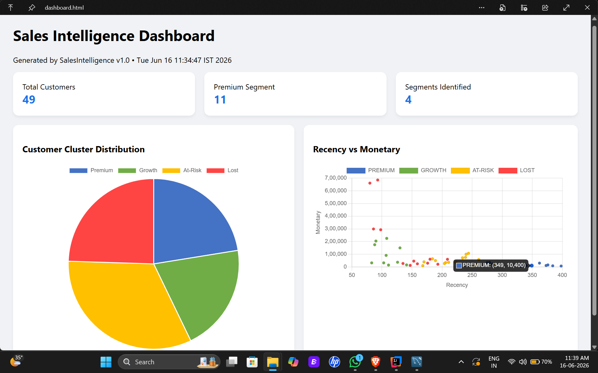
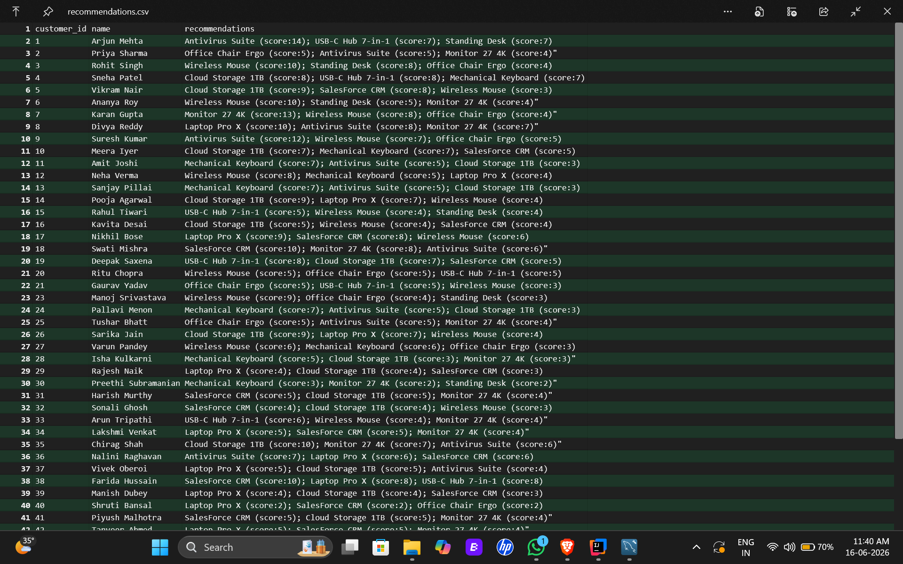
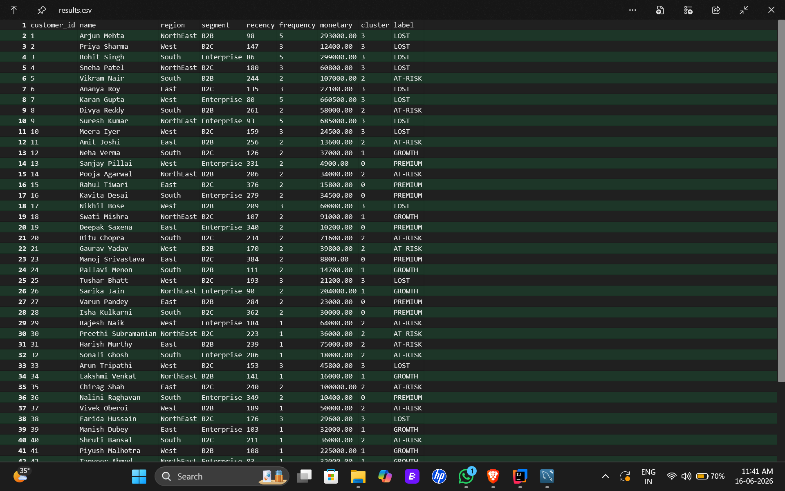
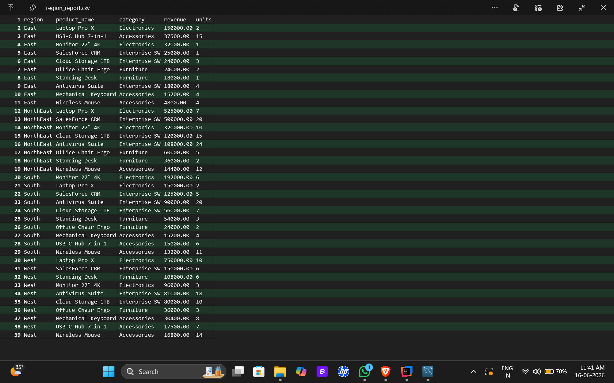
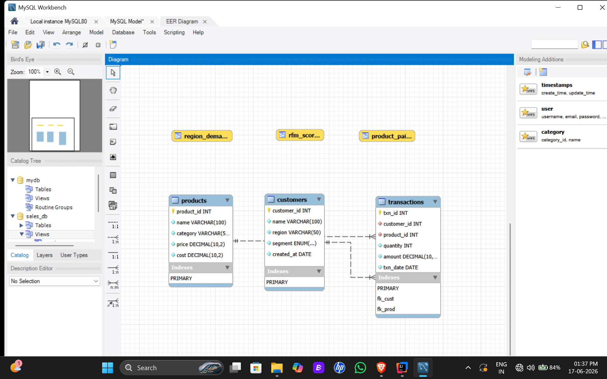

<div align="center">

# Sales Intelligence Framework

<p>A multi-layer data pipeline in Java that segments customers by behaviour,
detects market gaps, forecasts revenue, and recommends products using ML.</p>

[](https://openjdk.org/)
[](https://www.mysql.com/)
[](https://www.cs.waikato.ac.nz/ml/weka/)
[](https://maven.apache.org/)
[](https://creativecommons.org/licenses/by-nc-nd/4.0/)

</div>

---

## About

**--:** Swagat Samal  |  **Version:** 1.0  |  **Year:** 2026

End-to-end sales intelligence system: Java 17 + MySQL 8 + Weka ML.
Runs as a single Java application — connects to MySQL, processes RFM data,
runs machine learning, and generates CSV reports + an offline HTML dashboard.

---

## Features

| Module | Algorithm | Output |
|--------|-----------|--------|
| Customer Segmentation | K-Means Clustering (Weka, k=4) | Premium / Growth / At-Risk / Lost |
| Market Gap Detection | SQL CTEs + 40% percentile threshold | Underserved region-category pairs |
| Revenue Forecasting | Linear Regression (Weka) | 3-month forward projection |
| Product Recommendations | Item-based Collaborative Filtering | Top-3 products per customer |
| Region Analysis | SQL aggregation + MoM growth rates | Top products + trend by location |
| Dashboard | Canvas 2D — fully offline | Interactive HTML charts |

---

## Output Preview

### Dashboard


### Console Output Recommendations


### Results CSV


### Region Report


### EER Diagram
 
## Database Structure

### Core Tables
- customers
- products
- transactions

### Analytical Views
- rfm_scores
- product_pairs
- region_demand

---

## Project Structure

```
SalesIntelligence/
├── src/main/java/com/sales/
│   ├── Main.java                  ← Entry point
│   ├── DBConnection.java          ← JDBC via config.properties
│   ├── RFMCalculator.java         ← RFM features + ARFF export
│   ├── MLEngine.java              ← K-Means (Weka)
│   ├── GapDetector.java           ← Market gap SQL CTE
│   ├── RevenueForecaster.java     ← Linear Regression (Weka)
│   ├── ProductRecommender.java    ← Item-based collaborative filtering
│   ├── RegionAnalyser.java        ← Region demand + MoM growth
│   └── ChartExporter.java         ← Offline HTML dashboard (Canvas 2D)
├── src/main/resources/
│   ├── Schema.sql                 ← Tables + 3 views
│   ├── seed_data.sql              ← 50 customers, 10 products, 200+ transactions
│   └── config.example.properties  ← Credential (copy to config.properties)
├── doc/                           ← Output screenshots
├── pom.xml
├── LICENSE
└── README.md
```

---

## Quick Start

### Prerequisites
Java 17+ · MySQL 8.0 · Apache Maven 3.8+ · IntelliJ IDEA

### 1 — Clone
```bash
git clone https://github.com/Swagat-Samal/Sales-Intelligence-Framework.git
cd Sales-Intelligence-Framework
```

### 2 — Database setup
Open MySQL Workbench → new query tab → run in order:
```sql
SOURCE src/main/resources/Schema.sql;
SOURCE src/main/resources/seed_data.sql;
```
Verify: `SELECT COUNT(*) FROM rfm_scores;` — should return 49.

### 3 — Configure credentials

Open `config.properties` and set your MySQL password:
```properties
db.url=jdbc:mysql://localhost:3306/sales_db
db.user=root
db.password=MYSQL_PASSWORD
```
⚠️ `config.properties` is gitignored.

### 4 — Run
Right-click `Main.java` in IntelliJ → Run, or:
```bash
mvn clean compile exec:java -Dexec.mainClass="com.sales.Main"
```

### 5 — Outputs (auto-created in output/ folder)
| File | Contents |
|------|----------|
| `results.csv` | 50 customers with cluster labels |
| `recommendations.csv` | Top-3 product recs per customer |
| `region_report.csv` | Revenue + units by region and product |
| `rfm_data.arff` | Weka Explorer format for visual clustering |
| `dashboard.html` | Open in Browser — interactive charts |

### Reset dataset without dropping tables
```sql
USE sales_db;
SET FOREIGN_KEY_CHECKS = 0;
TRUNCATE TABLE transactions;
TRUNCATE TABLE customers;
TRUNCATE TABLE products;
SET FOREIGN_KEY_CHECKS = 1;
```

---

## Roadmap — v2.0 (Coming Soon)

- [ ] Spring Boot REST API 
- [ ] Real-time auto-refresh dashboard
- [ ] ARIMA time-series forecasting
- [ ] Churn prediction using Random Forest
- [ ] Matrix factorisation recommendations (SVD)
- [ ] Docker one-command setup
- [ ] JUnit 5 test suite
- [ ] Scheduled automation -- Java ScheduledExecutorService

---

## License

Copyright (c) 2026 Swagat Samal. All rights reserved.

[](https://creativecommons.org/licenses/by-nc-nd/4.0/)

Licensed under Creative Commons Attribution-NonCommercial-NoDerivatives 4.0.
You may view and share this work with attribution.
You may not use it commercially, modify it, or claim it as your own.

📧 POC: swagatsamal1@gmail.com

---

